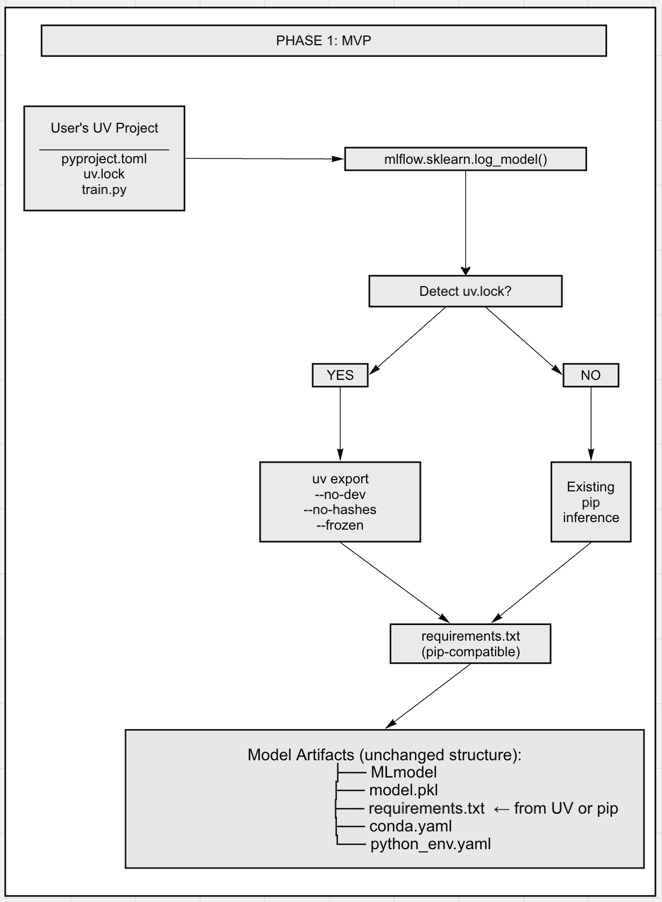

# MLflow UV Package Manager Support

| | |
|----------------------|--------------------------------------------------|
| **Author(s)** | Debu Sinha ([@debu-sinha](https://github.com/debu-sinha)) |
| **Organization** | MLflow Community |
| **Status** | DRAFT |
| **GitHub Issue** | [#12478](https://github.com/mlflow/mlflow/issues/12478) |

**Major changes:**
- 2025-12-05 Debu Sinha: Initial version

---

# Part I: Design Sketch

## Motivation

**The Problem (from GitHub Issue #12478):**

> "When using the uv package manager to create virtual environments and install packages, MLflow is unable to infer requirements.txt when auto-logging a model."

Users managing Python environments with UV must manually specify dependencies when logging models - defeating the purpose of MLflow's automatic dependency inference.

**Why UV matters:**
- 10-100x faster than pip for dependency installation ([Astral benchmarks](https://github.com/astral-sh/uv#benchmarks))
- Growing adoption in ML community (25+ upvotes, 22+ comments on issue)
- Combines best of pip (speed) and conda (Python version management)
- Created by Astral (same team behind Ruff, the fast Python linter)

**Current workaround (painful):**
```python
# Users must manually export and specify dependencies
import subprocess
result = subprocess.run(
    ["uv", "export", "--no-dev", "--no-hashes", "--frozen"],
    capture_output=True, text=True
)
requirements = result.stdout.strip().split("\n")

mlflow.sklearn.log_model(model, "model", pip_requirements=requirements)
```

**Goal:** Make UV projects "just work" with MLflow's existing dependency inference.

---

## Requirements

### Functional requirements

**MUST (MVP):**
- Detect UV-managed projects (presence of `uv.lock`) during `log_model()`
- Export `uv.lock` to pip-compatible `requirements.txt` using `uv export`
- Store `requirements.txt` with model artifacts (backwards compatible)
- Fall back gracefully to existing pip inference if UV not detected/available
- Add model tag `mlflow.requirements.source` to indicate inference method

**SHOULD (Phase 2):**
- Store `uv.lock` alongside model for full reproducibility
- Add `env_manager="uv"` option for faster environment restoration
- Support explicit `uv_lock` parameter in `log_model()` functions

**COULD (Future):**
- Prebuilt environment archives for cluster deployments
- UV support in `spark_udf()` for distributed inference
- Auto-install UV on worker nodes

### Non-functional requirements

| | MUST | SHOULD |
|-------------------------------------|----------|----------|
| Backwards compatibility | 100% | 100% |
| No new required dependencies | Yes | Yes |
| Works without Databricks | Yes | Yes |

### Out-of-scope (for this design)

- Replacing pip/conda as default
- UV-native MLflow Projects
- Distributed UV cache
- UI changes

---

## Proposal sketch

**Phase 1: Automatic UV Detection & Export (MVP)**



**Key insight:** Phase 1 requires NO changes to model artifact structure or loading logic. We simply improve how `requirements.txt` is generated.

---

## Major alternatives considered

### Alternative 1: Require explicit `uv_lock` parameter

```python
mlflow.sklearn.log_model(model, "model", uv_lock="./uv.lock")
```

**Rejected for MVP because:**
- Requires API changes across all flavors
- Doesn't solve the "just works" goal
- Can be added in Phase 2 for explicit control

### Alternative 2: Store uv.lock instead of requirements.txt

**Rejected for MVP because:**
- Breaks backwards compatibility
- Existing tooling expects requirements.txt
- Can be added as additional artifact in Phase 2

### Alternative 3: Add `env_manager="uv"` immediately

**Rejected for MVP because:**
- Larger scope, more testing needed
- Phase 1 already solves the core pain point
- Users can benefit from UV at logging time without this

---

# Part II: Detailed Design

## Phase 1 Implementation (MVP)

### Changes to `mlflow/utils/requirements_utils.py`

```python
# NEW: mlflow/utils/uv_utils.py

import subprocess
import shutil
from pathlib import Path
from typing import List, Optional
import logging
import os

_logger = logging.getLogger(__name__)

# Minimum UV version that supports all required flags
_MIN_UV_VERSION = "0.5.0"


def is_uv_available() -> bool:
    """Check if UV is installed and meets minimum version."""
    if shutil.which("uv") is None:
        return False

    try:
        result = subprocess.run(
            ["uv", "--version"],
            capture_output=True,
            text=True,
            timeout=5
        )
        # Parse version from output like "uv 0.5.1"
        version = result.stdout.strip().split()[-1]
        return _version_gte(version, _MIN_UV_VERSION)
    except Exception:
        return False


def _version_gte(version: str, min_version: str) -> bool:
    """Check if version >= min_version (simple semver comparison)."""
    def parse(v):
        return tuple(int(x) for x in v.split(".")[:3])
    try:
        return parse(version) >= parse(min_version)
    except ValueError:
        return False


def detect_uv_project(project_root: Optional[str] = None) -> Optional[Path]:
    """
    Detect if current directory or project_root is a UV project.

    Search order:
    1. Explicit project_root if provided
    2. Current working directory
    3. Walk up parent directories (max 5 levels) to handle monorepos

    Returns path to uv.lock if found, None otherwise.
    """
    search_paths = []

    if project_root:
        search_paths.append(Path(project_root))

    # Check current working directory
    cwd = Path.cwd()
    search_paths.append(cwd)

    # Walk up parent directories (for monorepos, running from subdirs)
    parent = cwd
    for _ in range(5):
        parent = parent.parent
        if parent == parent.parent:  # Reached root
            break
        search_paths.append(parent)

    for path in search_paths:
        uv_lock = path / "uv.lock"
        if uv_lock.exists():
            _logger.debug(f"Found uv.lock at {uv_lock}")
            return uv_lock

    return None


def export_uv_requirements(uv_lock_path: Path) -> List[str]:
    """
    Export uv.lock to pip-compatible requirements list.

    Uses: uv export --no-dev --no-hashes --no-emit-project --frozen

    Returns:
        List of requirement strings (e.g., ["numpy==1.24.0", "pandas==2.0.0"])

    Raises:
        RuntimeError: If uv export fails
    """
    if not is_uv_available():
        raise RuntimeError(
            f"UV >= {_MIN_UV_VERSION} is required to export uv.lock but is not installed. "
            "Install with: pip install uv"
        )

    project_dir = uv_lock_path.parent

    cmd = [
        "uv", "export",
        "--no-dev",           # Exclude dev dependencies
        "--no-hashes",        # Don't include hashes (cleaner output)
        "--no-emit-project",  # Don't include the project itself
        "--frozen",           # Use exact versions from lock, don't update
    ]

    try:
        result = subprocess.run(
            cmd,
            cwd=str(project_dir),
            capture_output=True,
            text=True,
            check=True,
            timeout=60,  # 1 minute timeout
        )

        # Parse output: filter empty lines and comments
        requirements = [
            line.strip()
            for line in result.stdout.strip().split("\n")
            if line.strip() and not line.strip().startswith("#")
        ]

        _logger.info(f"Exported {len(requirements)} requirements from uv.lock")
        return requirements

    except subprocess.CalledProcessError as e:
        _logger.warning(f"uv export failed: {e.stderr}")
        raise RuntimeError(f"Failed to export uv.lock: {e.stderr}")
    except subprocess.TimeoutExpired:
        raise RuntimeError("uv export timed out after 60 seconds")
```

### Changes to `_infer_requirements()`

```python
# In mlflow/utils/requirements_utils.py

def _infer_requirements(model_path: str, flavor: str, ...) -> List[str]:
    """
    Infer pip requirements for a model.

    MODIFIED: Now checks for UV project first.
    """
    from mlflow.utils.uv_utils import (
        is_uv_available,
        detect_uv_project,
        export_uv_requirements
    )

    # NEW: Try UV export first if uv.lock exists
    uv_lock = detect_uv_project()
    if uv_lock and is_uv_available():
        try:
            _logger.info(f"Detected UV project, exporting from {uv_lock}")
            requirements = export_uv_requirements(uv_lock)
            # Tag will be added by caller to indicate UV was used
            return requirements, "uv"
        except Exception as e:
            _logger.warning(
                f"UV export failed ({e}), falling back to pip inference"
            )

    # Existing pip inference logic (unchanged)
    return _infer_requirements_from_pip(model_path, flavor, ...), "pip"
```

### Observability

Add model tag to track inference source:

```python
# In log_model() after requirements inference
mlflow.set_tag("mlflow.requirements.source", source)  # "uv" or "pip"
mlflow.set_tag("mlflow.requirements.uv_version", uv_version)  # if UV used
```

### Error Handling

| Scenario | Behavior |
|----------|----------|
| `uv.lock` exists, UV installed | Export via `uv export` |
| `uv.lock` exists, UV not installed | Warning + fallback to pip inference |
| `uv.lock` exists, UV version too old | Warning + fallback to pip inference |
| `uv.lock` doesn't exist | Existing pip inference (no change) |
| `uv export` fails | Warning + fallback to pip inference |

### Security Considerations

- **Subprocess execution:** `uv export` runs as subprocess. The `uv_lock_path` is derived from filesystem detection, not user input, minimizing injection risk.
- **Lock file integrity:** If `pyproject.toml` is newer than `uv.lock`, log a warning suggesting user run `uv lock` first.
- **Supply chain:** UV export uses same package sources as pip - no additional supply chain risk.

### UV Version Compatibility

| UV Version | Supported | Notes |
|------------|-----------|-------|
| < 0.5.0 | ❌ | Missing required `--no-emit-project` flag |
| 0.5.0+ | ✅ | Full support |

### Testing

```python
# tests/utils/test_uv_utils.py

def test_detect_uv_project_found(tmp_path):
    """Test UV project detection when uv.lock exists."""
    (tmp_path / "uv.lock").touch()

    with change_cwd(tmp_path):
        result = detect_uv_project()
        assert result == tmp_path / "uv.lock"


def test_detect_uv_project_not_found(tmp_path):
    """Test UV project detection when no uv.lock."""
    with change_cwd(tmp_path):
        result = detect_uv_project()
        assert result is None


def test_detect_uv_project_parent_directory(tmp_path):
    """Test UV project detection finds uv.lock in parent (monorepo)."""
    (tmp_path / "uv.lock").touch()
    subdir = tmp_path / "packages" / "mypackage"
    subdir.mkdir(parents=True)

    with change_cwd(subdir):
        result = detect_uv_project()
        assert result == tmp_path / "uv.lock"


def test_export_uv_requirements(tmp_path, monkeypatch):
    """Test uv export produces valid requirements."""
    # Create minimal UV project
    create_test_uv_project(tmp_path)

    requirements = export_uv_requirements(tmp_path / "uv.lock")

    assert isinstance(requirements, list)
    assert len(requirements) > 0
    assert all("==" in req for req in requirements)


def test_fallback_when_uv_not_available(tmp_path, monkeypatch):
    """Test graceful fallback when UV not installed."""
    (tmp_path / "uv.lock").touch()
    monkeypatch.setattr(shutil, "which", lambda x: None)

    # Should not raise, should fall back to pip inference
    with change_cwd(tmp_path):
        requirements = _infer_requirements(...)
        assert requirements is not None


def test_version_check():
    """Test UV version comparison."""
    assert _version_gte("0.5.0", "0.5.0")
    assert _version_gte("0.5.1", "0.5.0")
    assert _version_gte("1.0.0", "0.5.0")
    assert not _version_gte("0.4.9", "0.5.0")
```

---

## Phase 2: Enhanced UV Support (Future)

After Phase 1 is validated, consider these enhancements:

### 2.1 Store uv.lock with model artifacts

```python
# Additional artifact alongside requirements.txt
model/
├── MLmodel
├── model.pkl
├── requirements.txt   # From uv export (pip-compatible)
├── uv.lock            # NEW: Original lock file
├── pyproject.toml     # NEW: Project definition
└── conda.yaml
```

**Benefit:** Full reproducibility via `uv sync` during model loading.

### 2.2 Add `env_manager="uv"` option

```python
mlflow.pyfunc.load_model(model_uri, env_manager="uv")
```

**Benefit:** Faster environment restoration (10-100x vs pip).

### 2.3 Explicit `uv_lock` parameter

```python
mlflow.sklearn.log_model(
    model, "model",
    uv_lock="./uv.lock",      # Explicit path
    project_root="./"          # For pyproject.toml
)
```

**Benefit:** Control over UV detection, support for non-standard project layouts.

### 2.4 Spark UDF support

```python
mlflow.pyfunc.spark_udf(spark, model_uri, env_manager="uv")
```

**Benefit:** Faster worker environment setup on clusters.

### 2.5 UV Workspace Support

UV supports workspaces (multiple packages in monorepo). Phase 2 should handle:
- Detecting workspace root vs member package
- Exporting dependencies for specific workspace member

---

## Platform Compatibility

### Phase 1 works everywhere

| Platform | Support | Notes |
|----------|---------|-------|
| Open-source MLflow | ✓ | S3, GCS, local, HDFS |
| Databricks Workspace Registry | ✓ | No changes needed |
| Databricks UC Registry | ✓ | No changes needed |
| Any Spark cluster | ✓ | Via existing mechanisms |

**Key point:** Phase 1 only changes how `requirements.txt` is generated. No changes to artifact storage, model loading, or serving.

### Phase 2+ considerations

- `env_manager="uv"` requires UV on serving environment
- `spark_udf` with UV needs UV on worker nodes
- Prebuilt archives have Unity Catalog access mode limitations (Dedicated mode required for UC Volumes)

---

## Rollout Plan

### Phase 1a: Behind feature flag
1. Implement `uv_utils.py` with detection and export
2. Add `MLFLOW_ENABLE_UV_INFERENCE` env var (default: True)
3. Add `MLFLOW_DISABLE_UV_INFERENCE` escape hatch
4. Unit tests + integration tests
5. Documentation update

### Phase 1b: General availability
1. Remove feature flags after validation period
2. Address any issues from early adopters

### Phase 2 (if Phase 1 successful)
1. Store uv.lock with artifacts
2. Add `env_manager="uv"`
3. Add explicit `uv_lock` parameter
4. Spark UDF support
5. Workspace support

---

# Appendix: Design Decisions

## Decision 1: Auto-detect vs explicit parameter

| Option | Pros | Cons |
|--------|------|------|
| **Auto-detect (chosen for MVP)** | "Just works", no API changes | May surprise users |
| Explicit parameter | Clear intent | Requires API changes, more friction |

**Rationale:** Users want UV projects to work without extra configuration. Auto-detect with fallback provides this while maintaining backwards compatibility.

## Decision 2: Generate requirements.txt vs store uv.lock

| Option | Pros | Cons |
|--------|------|------|
| **Generate requirements.txt (Phase 1)** | 100% backwards compatible | Loses some UV benefits |
| Store uv.lock only | Full UV benefits | Breaks existing tooling |
| Both (Phase 2) | Best of both worlds | More complexity |

**Rationale:** Start with backwards-compatible approach, add uv.lock storage in Phase 2.

## Decision 3: Fail vs fallback when UV unavailable

| Option | Pros | Cons |
|--------|------|------|
| **Fallback to pip (chosen)** | Graceful degradation | May hide issues |
| Fail with error | Clear failure mode | Blocks users without UV |

**Rationale:** UV detection is opportunistic. If it fails, existing pip inference still works.

---

# Appendix: References

1. **GitHub Issue:** [#12478 - Support `uv` Package Installer](https://github.com/mlflow/mlflow/issues/12478)
2. **UV Documentation:** [https://docs.astral.sh/uv/](https://docs.astral.sh/uv/)
3. **UV Benchmarks:** [https://github.com/astral-sh/uv#benchmarks](https://github.com/astral-sh/uv#benchmarks)
4. **MLflow Dependency Management:** [https://mlflow.org/docs/latest/ml/model/dependencies/](https://mlflow.org/docs/latest/ml/model/dependencies/)

---

# Appendix: Example Usage (After Phase 1)

```python
# User's workflow - NO CHANGES NEEDED

# 1. User has UV project
#    pyproject.toml
#    uv.lock
#    train.py

# 2. User trains and logs model (unchanged code)
import mlflow
from sklearn.ensemble import RandomForestClassifier

model = RandomForestClassifier()
model.fit(X_train, y_train)

with mlflow.start_run():
    # This "just works" now - UV detected automatically
    mlflow.sklearn.log_model(model, "model")

# 3. Model artifacts include requirements.txt generated from uv.lock
#    - Full transitive dependencies captured
#    - Exact versions pinned
#    - Works with existing MLflow serving
```

**That's it.** The user's code doesn't change. MLflow detects UV and does the right thing.
