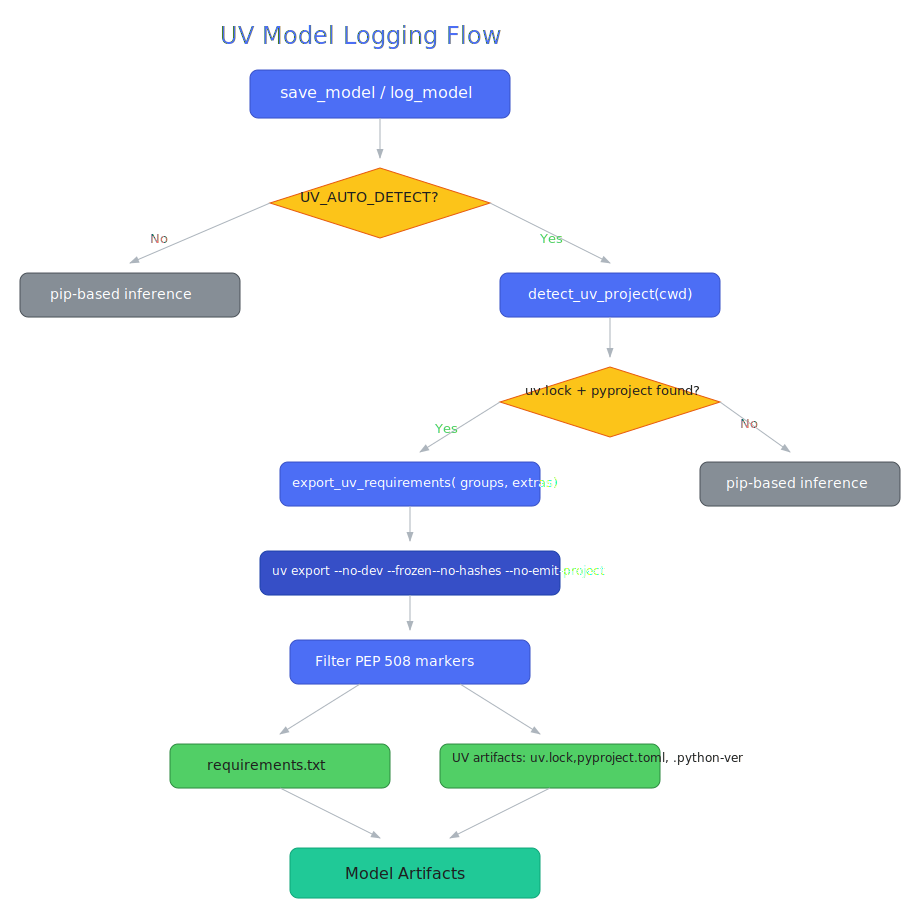
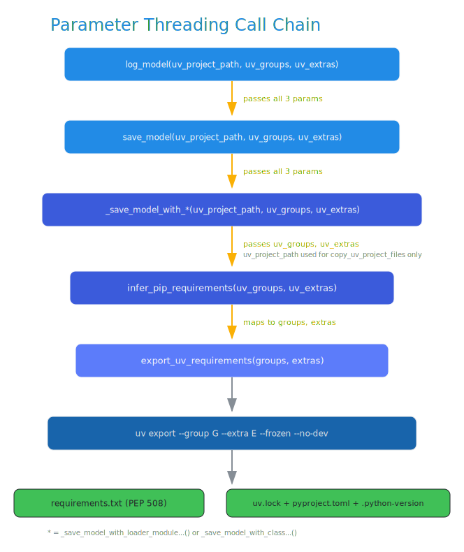

# MLflow UV Package Manager Support - Design Document v2

|                    |                                                           |
| ------------------ | --------------------------------------------------------- |
| **Author(s)**      | Debu Sinha ([@debu-sinha](https://github.com/debu-sinha)) |
| **Organization**   | MLflow Community                                          |
| **Status**         | IN REVIEW                                                 |
| **GitHub Issue**   | [#12478](https://github.com/mlflow/mlflow/issues/12478)   |
| **Pull Request**   | [#20344](https://github.com/mlflow/mlflow/pull/20344), [#20935](https://github.com/mlflow/mlflow/pull/20935) (Phase 2) |
| **Reviewers**      | [@harupy](https://github.com/harupy) (Harutaka Kawamura, MLflow Core Maintainer), [@WeichenXu123](https://github.com/WeichenXu123) (Weichen Xu, MLflow Core Maintainer) |

**Change Log:**

- 2025-12-05: Initial design version (v1)
- 2026-01-26: Updated to reflect Phase 1 + Phase 2 implementation
- 2026-01-30: Renamed `uv_lock` to `uv_project_path`; added `MLFLOW_UV_AUTO_DETECT`; added `_create_virtualenv` integration
- 2026-02-10: Full rewrite with Excalidraw diagrams, `uv_groups`/`uv_extras` API params, complete implementation state (v2 final)
- 2026-02-20: v2.1 -- Aligned doc with actual implementation after deep code review. Moved `uv_groups`/`uv_extras`, PEP 508 marker filtering, and private index extraction to Future Work. Simplified function signatures to match shipped code.
- 2026-02-20: v2.2 -- Added Phase 2 PR details: `uv_groups`, `uv_extras`, and `only_groups` params now implemented on `feature/uv-groups-extras` branch. Updated function signatures, test counts, and call chain.
- 2026-02-24: v2.3 -- Fixed `MLFLOW_UV_AUTO_DETECT` bypass bug. The `uv_source_dir = uv_project_path or original_cwd` pattern always resolved to non-None (CWD), making the env var check dead code. Now gated properly with explicit if/elif/else. Updated call chain, `detect_uv_project` return type, and test counts.
- 2026-02-27: v2.4 -- Added `--no-annotate` flag per harupy review. Corrected Phase 2 `infer_pip_requirements` signature (adds params alongside `uv_project_dir`, not replacing). Moved private index extraction from Future Work to Phase 1 (already implemented). Added PR #20935 reference for Phase 2. Updated test counts to match actual (86 on base).

---

## Executive Summary

This document describes the design and implementation of native UV package manager support in MLflow for automatic dependency inference during model logging. UV is 8-10x faster than pip (cold cache) and 80-115x faster (warm cache), with growing adoption in the ML/data science community.

**What's Implemented (Phase 1 -- PR #20344):**

- Automatic UV project detection (`uv.lock` + `pyproject.toml` in CWD)
- Dependency export via `uv export --no-annotate` (environment markers preserved for pip evaluation)
- UV artifact logging (`uv.lock`, `pyproject.toml`, `.python-version`)
- `uv_project_path` parameter for monorepo support
- `MLFLOW_UV_AUTO_DETECT` environment variable to disable auto-detection
- `MLFLOW_LOG_UV_FILES` environment variable to disable artifact logging
- UV-based environment restoration functions (`setup_uv_sync_environment`, `run_uv_sync`)
- Private index URL extraction from `uv.lock` (`extract_index_urls_from_uv_lock`)
- Graceful fallback to pip-based inference on any UV failure

**What's Implemented (Phase 2 -- PR [#20935](https://github.com/mlflow/mlflow/pull/20935)):**

- `uv_groups` and `uv_extras` parameters on `save_model()` / `log_model()`
- `groups`, `only_groups`, and `extras` parameters on `export_uv_requirements()`
- `uv_groups` and `uv_extras` parameters threaded through `infer_pip_requirements()`
- `only_groups` takes precedence over `groups` when both are specified

**Future Work (Phase 3):**

- `MLFLOW_UV_GROUPS`, `MLFLOW_UV_ONLY_GROUPS`, `MLFLOW_UV_EXTRAS` environment variables
- PEP 508 marker filtering (deferred -- pip handles markers natively at install time, per Decision 6)

---

# Part I: Design Overview

## Motivation

**The Problem (from GitHub Issue #12478):**

> "When using the uv package manager to create virtual environments and install packages, MLflow is unable to infer requirements.txt when auto-logging a model."

Users managing Python environments with UV must manually specify dependencies when logging models -- defeating the purpose of MLflow's automatic dependency inference.

**Why UV matters:**

- 8-10x faster than pip (cold cache), 80-115x faster (warm cache)
- Growing adoption in ML community (25+ upvotes, 22+ comments on issue)
- Combines pip, virtualenv, and pyenv functionality
- Better reproducibility via deterministic lock files

**Current workaround (painful):**

```python
# Users must manually export and specify dependencies
import subprocess
result = subprocess.run(
    ["uv", "export", "--no-dev", "--no-hashes", "--frozen"],
    capture_output=True, text=True
)
requirements = result.stdout.strip().split("\n")
mlflow.sklearn.log_model(model, "model", pip_requirements=requirements)
```

**Goal:** Make UV projects "just work" with MLflow's existing dependency inference.

---

## Architecture Overview

### Model Logging Flow

The diagram below shows the complete model logging flow with UV integration.



When `save_model()` or `log_model()` is called:

1. Check `MLFLOW_UV_AUTO_DETECT` (default: `true`). If disabled, skip UV detection entirely.
2. Call `detect_uv_project()` to look for `uv.lock` + `pyproject.toml` in the directory specified by `uv_project_path` (or CWD if not provided).
3. If found and UV >= 0.5.0 is installed, run `uv export --no-dev --no-hashes --frozen --no-header --no-emit-project --no-annotate`.
4. Environment markers in the output are preserved as-is for pip to evaluate at install time.
5. Separately, call `copy_uv_project_files()` with `source_dir` determined by: (a) explicit `uv_project_path` if provided, (b) CWD if `MLFLOW_UV_AUTO_DETECT` is true, or (c) skip entirely if auto-detect is disabled. UV artifacts (`uv.lock`, `pyproject.toml`, `.python-version`) are logged unless `MLFLOW_LOG_UV_FILES=false`.
6. If any step fails, fall back gracefully to standard pip-based inference (capture imported packages).

### Parameter Threading Call Chain

The `uv_project_path`, `uv_groups`, and `uv_extras` parameters flow through the full call chain from user API to subprocess invocation.



**Phase 1 (base):**
```
log_model(uv_project_path)
  -> save_model(uv_project_path)
    -> _save_model_with_loader_module_and_data_path(uv_project_path)
       OR _save_model_with_class_artifacts_params(uv_project_path)
      -> uv_source_dir:
           if uv_project_path is not None -> uv_project_path
           elif MLFLOW_UV_AUTO_DETECT is true -> original_cwd
           else -> None (skip UV entirely)
      -> infer_pip_requirements(uv_project_dir=uv_source_dir)
        -> detect_uv_project(uv_project_dir)  # returns UVProjectInfo | None
        -> export_uv_requirements(project_dir)
          -> subprocess: uv export --no-dev --no-hashes --frozen --no-header --no-emit-project --no-annotate
      -> if uv_source_dir is not None:
           copy_uv_project_files(source_dir=uv_source_dir)
```

**Phase 2 (with groups/extras):**
```
log_model(uv_project_path, uv_groups, uv_extras)
  -> save_model(uv_project_path, uv_groups, uv_extras)
    -> _save_model_with_loader_module_and_data_path(uv_project_path, uv_groups, uv_extras)
       OR _save_model_with_class_artifacts_params(uv_project_path, uv_groups, uv_extras)
      -> infer_pip_requirements(uv_project_dir, uv_groups, uv_extras)
        -> detect_uv_project(uv_project_dir)
        -> export_uv_requirements(project_dir, groups=uv_groups, extras=uv_extras)
          -> subprocess: uv export ... [--group <name>]... [--extra <name>]...
```

### Environment Restoration Flow

When loading a model that was logged from a UV project, the restoration path depends on whether `uv.lock` is in the artifacts.


---

## Implementation Summary

### Core Features

| Feature                      | Status  | Description                                                             |
| ---------------------------- | ------- | ----------------------------------------------------------------------- |
| UV Project Detection         | Done    | Check for `uv.lock` + `pyproject.toml` in CWD or specified directory    |
| Dependency Export             | Done    | `uv export --no-dev --no-hashes --frozen --no-header --no-emit-project --no-annotate` |
| UV Artifact Logging          | Done    | Log `uv.lock`, `pyproject.toml`, `.python-version`                      |
| `uv_project_path` parameter  | Done    | Explicit UV project path for monorepo support                           |
| `MLFLOW_UV_AUTO_DETECT`      | Done    | Disable UV auto-detection (default: `true`)                             |
| `MLFLOW_LOG_UV_FILES`        | Done    | Disable UV file logging (default: `true`)                               |
| UV Sync Functions            | Done    | `setup_uv_sync_environment()`, `run_uv_sync()`                          |
| Graceful Fallback            | Done    | Falls back to pip inference on any UV failure                           |

### Phase 2 Features (`feature/uv-groups-extras` branch)

| Feature                         | Status | Description                                                                  |
| ------------------------------- | ------ | ---------------------------------------------------------------------------- |
| `uv_groups` parameter           | Done   | Selective dependency group export on `save_model`/`log_model`                |
| `uv_extras` parameter           | Done   | Optional extras export on `save_model`/`log_model`                           |
| `groups` on `export_uv_requirements` | Done | Maps to `uv export --group <name>` (additive with project deps)         |
| `only_groups` on `export_uv_requirements` | Done | Maps to `uv export --only-group <name>` (exclusive, no project deps) |
| `extras` on `export_uv_requirements` | Done | Maps to `uv export --extra <name>`                                      |

### Future Work (Phase 3)

| Feature                      | Status   | Description                                                             |
| ---------------------------- | -------- | ----------------------------------------------------------------------- |
| Dependency groups (env vars) | Planned  | `MLFLOW_UV_GROUPS`, `MLFLOW_UV_ONLY_GROUPS`, `MLFLOW_UV_EXTRAS`         |
| PEP 508 Marker Filtering     | Deferred | Pip handles markers natively at install time (see Decision 6)           |

### NOT Implemented (Design Decisions)

| Feature                      | Reason                                              |
| ---------------------------- | --------------------------------------------------- |
| `log_uv_files` API parameter | Environment variable approach is less error-prone   |
| Auto-prepend index URLs      | Error-prone, may inject wrong/stale URLs            |
| Parent directory search      | CWD-only detection is deterministic and predictable |

---

# Part II: Detailed Implementation

## Core Module: `mlflow/utils/uv_utils.py`

### Functions

| Function                          | Visibility | Purpose                                              |
| --------------------------------- | ---------- | ---------------------------------------------------- |
| `get_uv_version()`                | Public     | Get installed uv version as `Version \| None`        |
| `_get_uv_binary()`               | Private    | Return uv binary path if installed and >= 0.5.0      |
| `is_uv_available()`               | Public     | Check UV >= 0.5.0 is installed                       |
| `UVProjectInfo` (NamedTuple)      | Public     | Holds `uv_lock: Path` and `pyproject: Path`          |
| `detect_uv_project(directory)`    | Public     | Find `uv.lock` + `pyproject.toml`; returns `UVProjectInfo \| None` |
| `export_uv_requirements(directory, groups, only_groups, extras)` | Public | Run `uv export` and parse output |
| `copy_uv_project_files(dest_dir, source_dir)` | Public    | Copy UV artifacts to model dir                      |
| `extract_index_urls_from_uv_lock(uv_lock_path)` | Public | Extract private index URLs from `uv.lock` |
| `create_uv_sync_pyproject(dest, python_version)` | Public | Create minimal pyproject.toml for uv sync |
| `setup_uv_sync_environment(env_dir, model_path, python_version)` | Public | Prepare for `uv sync --frozen` |
| `run_uv_sync(project_dir, frozen, no_dev, capture_output)` | Public | Execute `uv sync` for environment restoration |
| `has_uv_lock_artifact(model_path)` | Public    | Check if model has `uv.lock` artifact               |

### UV Detection

```python
_MIN_UV_VERSION = Version("0.5.0")

def detect_uv_project(directory: str | Path | None = None) -> UVProjectInfo | None:
    """
    Detect UV project by checking for BOTH uv.lock and pyproject.toml.
    CWD-only detection (no parent directory search).

    Returns UVProjectInfo(uv_lock, pyproject) NamedTuple, or None.
    """
```

### Dependency Export

**Phase 1 signature (base):**
```python
def export_uv_requirements(
    directory: str | Path | None = None,
    no_dev: bool = True,
    no_hashes: bool = True,
    frozen: bool = True,
) -> list[str] | None:
```

**Phase 2 signature (with groups/extras):**
```python
def export_uv_requirements(
    directory: str | Path | None = None,
    no_dev: bool = True,
    no_hashes: bool = True,
    frozen: bool = True,
    groups: list[str] | None = None,
    only_groups: list[str] | None = None,
    extras: list[str] | None = None,
) -> list[str] | None:
```

The export function:
1. Checks UV availability via `_get_uv_binary()` (returns `None` if unavailable)
2. Builds the `uv export` command with base flags (`--no-dev --no-hashes --frozen --no-header --no-emit-project --no-annotate`)
3. Appends group/extras flags if provided (`--group`, `--only-group`, `--extra`)
4. `only_groups` takes precedence over `groups` when both are specified
5. Strips any remaining comment lines and blank lines (safety net; `--no-annotate` handles most)
6. Preserves environment markers as-is (pip evaluates them at install time)
7. Returns `None` on any failure (graceful fallback)

### Environment Restoration

```python
def run_uv_sync(
    project_dir: str | Path,
    frozen: bool = True,
    no_dev: bool = True,
    capture_output: bool = False,
) -> bool:
    """Execute uv sync --frozen --no-dev for environment restoration."""
```

---

## Public API Changes

### `save_model()` / `log_model()` Parameters

**Phase 1:** One new parameter added to `mlflow.pyfunc.save_model()` and `mlflow.pyfunc.log_model()`.

**Phase 2:** Two additional parameters for dependency group and extras control.

```python
mlflow.pyfunc.save_model(
    python_model=model,
    name="model",
    uv_project_path="/path/to/monorepo/package",  # Explicit UV project dir
    uv_groups=["serving"],                          # Phase 2: dependency groups
    uv_extras=["gpu"],                              # Phase 2: optional extras
)
```

| Parameter         | Type                       | Default | Phase | Description                                     |
| ----------------- | -------------------------- | ------- | ----- | ----------------------------------------------- |
| `uv_project_path` | `str \| Path \| None`     | `None`  | 1     | Explicit path to UV project (for monorepos)     |
| `uv_groups`       | `list[str] \| None`       | `None`  | 2     | Dependency groups to include (`--group <name>`) |
| `uv_extras`       | `list[str] \| None`       | `None`  | 2     | Optional extras to include (`--extra <name>`)   |

---

## Environment Variables

| Variable                | Default | Description                                               |
| ----------------------- | ------- | --------------------------------------------------------- |
| `MLFLOW_UV_AUTO_DETECT` | `true`  | Set to `false` to disable UV project auto-detection       |
| `MLFLOW_LOG_UV_FILES`   | `true`  | Set to `false`/`0` to disable UV file logging              |

Both are standard MLflow `_BooleanEnvironmentVariable` instances defined in `mlflow/environment_variables.py`.

**Usage Examples:**

```bash
# Disable UV auto-detection entirely
MLFLOW_UV_AUTO_DETECT=false python train.py

# Disable UV file logging (for large projects)
MLFLOW_LOG_UV_FILES=false python train.py
```

---

## Integration with `infer_pip_requirements()`

The `infer_pip_requirements()` function in `mlflow/utils/environment.py` is the bridge between model saving and UV export:

**Phase 1 signature:**
```python
def infer_pip_requirements(
    model_uri,
    flavor,
    fallback=None,
    timeout=None,
    extra_env_vars=None,
    uv_project_dir: str | None = None,
):
```

**Phase 2 signature (adds groups/extras alongside uv_project_dir):**
```python
def infer_pip_requirements(
    model_uri,
    flavor,
    fallback=None,
    timeout=None,
    extra_env_vars=None,
    uv_project_dir=None,
    uv_groups: list[str] | None = None,
    uv_extras: list[str] | None = None,
):
```

**Note:** Phase 2 adds `uv_groups` and `uv_extras` alongside the existing `uv_project_dir` parameter. All three thread through together.

When called:
1. If `MLFLOW_UV_AUTO_DETECT` is `true` (default), attempt CWD-based UV detection
2. Call `detect_uv_project()` -- if no UV project found, use standard inference
3. Call `export_uv_requirements(project_dir, groups=uv_groups, extras=uv_extras)` (Phase 2 threads groups/extras)
4. If UV export returns a list (including empty list), use it directly
5. If UV export returns `None`, fall back to standard package-capture inference

---

## UV-Based Environment Restoration

### Restoration Functions

```python
def setup_uv_sync_environment(
    env_dir: str | Path,
    model_path: str | Path,
    python_version: str,
) -> bool:
    """Prepare UV project structure for uv sync --frozen."""

def run_uv_sync(
    project_dir: str | Path,
    capture_output: bool = False,
    extra_env: dict[str, str] | None = None,
) -> bool:
    """Execute uv sync --frozen --no-dev for environment restoration."""

def has_uv_lock_artifact(model_path: str | Path) -> bool:
    """Check if model has uv.lock artifact."""
```

The restoration flow:
1. Check if model artifacts contain `uv.lock`
2. Copy `uv.lock` to environment directory
3. Copy `pyproject.toml` from model artifacts if available, otherwise create a minimal one with pinned Python version (`requires-python = "==3.11.5"`)
4. Copy `.python-version` if available
5. Run `uv sync --frozen --no-dev` in the environment directory
6. Fall back to pip if any step fails

---

## Graceful Degradation

| Scenario                      | Behavior                                  |
| ----------------------------- | ----------------------------------------- |
| UV not installed              | Falls back to pip inference, logs warning |
| UV version < 0.5.0            | Falls back to pip inference, logs debug   |
| `uv export` fails             | Falls back to pip inference, logs warning |
| No UV project detected        | Uses standard pip inference (no warning)  |
| `MLFLOW_UV_AUTO_DETECT=false` | Skips UV detection entirely               |
| `MLFLOW_LOG_UV_FILES=false`   | Skips UV file logging, logs debug         |

---

## Bug Fix: `MLFLOW_UV_AUTO_DETECT` Bypass (v2.3)

### Problem

The original implementation in `model.py` and `__init__.py` used:

```python
uv_source_dir = uv_project_path or original_cwd
```

Since `original_cwd = Path.cwd()` is never `None`, `uv_source_dir` always resolved to a non-None value. This made the `MLFLOW_UV_AUTO_DETECT` environment variable check in `infer_pip_requirements()` dead code -- the condition `if uv_project_dir is not None or MLFLOW_UV_AUTO_DETECT.get()` was always `True` via the first operand.

In CI (where the MLflow repo itself contains `uv.lock` + `pyproject.toml`), this caused `uv export` to dump all 87 development dependencies instead of the model's actual imports, breaking tests.

### Root Cause

WeichenXu123's original review suggested `uv_source_dir = uv_project_path or Path.cwd()` before the `MLFLOW_UV_AUTO_DETECT` env var existed. When the env var was added later (in response to a separate review comment), the `or Path.cwd()` fallback was not updated to respect the new gating.

### Fix

Changed both `model.py` and `__init__.py` to gate on `MLFLOW_UV_AUTO_DETECT` explicitly:

```python
if uv_project_path is not None:
    uv_source_dir = uv_project_path
elif MLFLOW_UV_AUTO_DETECT.get():
    uv_source_dir = original_cwd
else:
    uv_source_dir = None

# Both infer_pip_requirements and copy_uv_project_files gate on non-None
if uv_source_dir is not None:
    copy_uv_project_files(dest_dir=path, source_dir=uv_source_dir)
# infer_pip_requirements receives uv_project_dir=uv_source_dir
# and internally checks: if uv_project_dir is not None or MLFLOW_UV_AUTO_DETECT.get()
```

This ensures:
- Explicit `uv_project_path` always takes priority (user intent is clear)
- CWD-based auto-detection only happens when `MLFLOW_UV_AUTO_DETECT=true` (the default)
- Setting `MLFLOW_UV_AUTO_DETECT=false` disables all UV detection when no explicit path is given
- The session-scoped `disable_uv_auto_detect` fixture in `tests/conftest.py` is now properly respected

---

## Model Artifacts Structure

When a UV project is detected and logged:

```
model/
+-- MLmodel
+-- model.pkl
+-- requirements.txt    # Generated via uv export (pip-compatible)
+-- uv.lock             # Original lock file (for uv sync restore)
+-- pyproject.toml       # Project definition
+-- .python-version     # Python version (if exists)
+-- conda.yaml
```

---

## Modified Files

### Phase 1 (PR #20344)

| File                               | Changes                                              |
| ---------------------------------- | ---------------------------------------------------- |
| `mlflow/utils/uv_utils.py`        | NEW: All UV detection, export, and sync functions    |
| `mlflow/utils/environment.py`     | `infer_pip_requirements()`: UV detection + export    |
| `mlflow/pyfunc/__init__.py`       | `save_model`/`log_model`: `uv_project_path` param   |
| `mlflow/pyfunc/model.py`          | `_save_model_with_class_artifacts_params`: UV params |
| `mlflow/environment_variables.py` | `MLFLOW_UV_AUTO_DETECT`, `MLFLOW_LOG_UV_FILES`       |
| `tests/utils/test_uv_utils.py`    | Unit tests (64 tests)                                |
| `tests/pyfunc/test_uv_model_logging.py` | Integration tests (22 tests)                   |

### Phase 2 (`feature/uv-groups-extras` branch)

| File                               | Changes                                                      |
| ---------------------------------- | ------------------------------------------------------------ |
| `mlflow/utils/uv_utils.py`        | `export_uv_requirements`: add `groups`, `only_groups`, `extras` params |
| `mlflow/utils/environment.py`     | `infer_pip_requirements`: add `uv_groups`, `uv_extras` params |
| `mlflow/pyfunc/__init__.py`       | `save_model`/`log_model`: add `uv_groups`, `uv_extras` params |
| `mlflow/pyfunc/model.py`          | `_save_model_with_class_artifacts_params`: thread `uv_groups`/`uv_extras` |
| `tests/utils/test_uv_utils.py`    | Unit tests (64+ tests -- 5 added for groups/extras on Phase 1 base) |
| `tests/pyfunc/test_uv_model_logging.py` | Integration tests (22+ tests -- 3 added for groups/extras)     |

---

## Test Coverage

### Phase 1 (PR #20344): 86 tests (46 unit functions + 16 integration functions, expanding to 86 with parametrize)

#### Unit Tests (`tests/utils/test_uv_utils.py`) - 46 test functions (expanding to ~69 with parametrize)

- UV binary detection and version checking
- `is_uv_available()` with various version strings and error conditions
- Project detection (CWD-only, explicit directory, missing files)
- Dependency export (requirements parsing, comment stripping, marker preservation, empty output, errors)
- UV file copying (with/without .python-version, env var toggling, monorepo layouts, missing files)
- `MLFLOW_UV_AUTO_DETECT` env var behavior (default true, false/true variants)
- `infer_pip_requirements()` UV integration (detection, export, fallback, explicit path overrides)
- UV sync environment setup (with/without existing pyproject, missing uv.lock)
- `run_uv_sync()` (command construction, extra_env merging, failure handling)
- `has_uv_lock_artifact()` positive and negative cases

#### Integration Tests (`tests/pyfunc/test_uv_model_logging.py`) - 16 test functions (expanding to ~17 with parametrize)

- Real UV project creation and locking (using `uv lock`)
- Real `uv export` to generate requirements
- End-to-end `log_model()` with UV artifacts (uv.lock, pyproject.toml, .python-version)
- `save_model()` with UV project detection
- Explicit `uv_project_path` parameter (working from different directory)
- `MLFLOW_LOG_UV_FILES` env var behavior (false/true variants)
- Fallback behavior (uv not available, uv export fails)
- Non-UV project standard inference
- Model loading and prediction with UV artifacts
- Real `setup_uv_sync_environment()` and `run_uv_sync()`

### Phase 2 (PR [#20935](https://github.com/mlflow/mlflow/pull/20935)): 94 tests (rebased on Phase 1)

#### Unit Tests - 69+ test items (5 new functions for groups/extras added on top of Phase 1 base)

New tests added:
- `test_export_uv_requirements_passes_groups_to_command` -- verifies `--group` flags in subprocess command
- `test_export_uv_requirements_passes_only_groups_to_command` -- verifies `--only-group` flags
- `test_export_uv_requirements_passes_extras_to_command` -- verifies `--extra` flags
- `test_export_uv_requirements_only_groups_takes_precedence_over_groups` -- mutual exclusivity
- `test_infer_pip_requirements_passes_groups_and_extras_to_uv_export` -- threading verification

Tests consolidated (removed in cleanup):
- `test_export_uv_requirements_returns_empty_list_on_empty_output`
- `test_export_uv_requirements_returns_none_when_uv_binary_missing`
- `test_export_uv_requirements_strips_comment_lines`
- `test_infer_pip_requirements_uses_explicit_uv_project_dir`
- `test_setup_uv_sync_environment_copies_existing_pyproject`

#### Integration Tests - 22+ tests (3 new for groups/extras added on top of Phase 1 base)

New tests added:
- `test_export_uv_requirements_with_groups_real` -- real `uv lock` + export with `--group`
- `test_export_uv_requirements_with_only_groups_real` -- real export with `--only-group`
- `test_export_uv_requirements_with_extras_real` -- real export with `--extra`

```bash
# Run all UV tests (Phase 1)
uv run pytest tests/utils/test_uv_utils.py tests/pyfunc/test_uv_model_logging.py -v

# Run only groups/extras tests (Phase 2)
uv run pytest tests/utils/test_uv_utils.py -k "groups or extras" -v
uv run pytest tests/pyfunc/test_uv_model_logging.py -k "groups or extras" -v
```

---

## Example Usage

### Basic Usage (Just Works)

```python
# User has UV project with uv.lock + pyproject.toml
# No code changes needed!

import mlflow
from sklearn.ensemble import RandomForestClassifier

model = RandomForestClassifier()
model.fit(X_train, y_train)

with mlflow.start_run():
    # UV detected automatically, dependencies exported via uv export
    mlflow.sklearn.log_model(model, "model")
```

### Monorepo Support

```python
mlflow.sklearn.log_model(
    model, "model",
    uv_project_path="/path/to/monorepo/package"
)
```

### Disable UV Auto-Detection

```bash
# Via environment variable
MLFLOW_UV_AUTO_DETECT=false python train.py
```

### Disable UV File Logging

```bash
# Via environment variable (for large projects)
MLFLOW_LOG_UV_FILES=false python train.py
```

### Include Dependency Groups (Phase 2)

```python
# Include "serving" dependency group from pyproject.toml
mlflow.pyfunc.log_model(
    python_model=model,
    name="model",
    uv_groups=["serving"],  # Maps to uv export --group serving
)
```

### Include Optional Extras (Phase 2)

```python
# Include "gpu" extras from pyproject.toml [project.optional-dependencies]
mlflow.pyfunc.log_model(
    python_model=model,
    name="model",
    uv_extras=["gpu"],  # Maps to uv export --extra gpu
)
```

### Combine Groups and Extras (Phase 2)

```python
mlflow.pyfunc.log_model(
    python_model=model,
    name="model",
    uv_project_path="/path/to/monorepo/package",
    uv_groups=["serving", "ml"],
    uv_extras=["gpu"],
)
```

---

## Design Decisions

### Decision 1: CWD-only vs parent directory search

| Option                  | Chosen | Rationale                                |
| ----------------------- | ------ | ---------------------------------------- |
| CWD-only detection      | Yes    | Deterministic, predictable, no surprises |
| Parent directory search | No     | May find wrong uv.lock in monorepos      |

### Decision 2: `MLFLOW_UV_AUTO_DETECT` as standard `_BooleanEnvironmentVariable`

| Option                              | Chosen | Rationale                                     |
| ----------------------------------- | ------ | --------------------------------------------- |
| `_BooleanEnvironmentVariable`       | Yes    | Consistent with MLflow patterns, centralized  |
| Custom env var parsing in uv_utils  | No     | Scattered, not discoverable                   |

### Decision 3: Environment variable vs API parameter for disabling UV file logging

| Option                         | Chosen | Rationale                               |
| ------------------------------ | ------ | --------------------------------------- |
| `MLFLOW_LOG_UV_FILES` env var  | Yes    | No code changes needed, CI/CD friendly  |
| `log_uv_files=False` parameter | No     | Requires API changes across all flavors |

### Decision 4: Hardcode export flags vs parameterize

| Option                              | Chosen | Rationale                                          |
| ----------------------------------- | ------ | -------------------------------------------------- |
| Hardcode `--no-dev --frozen` etc.   | Yes    | Every call site uses the same flags; params unused  |
| Parameterize each flag              | No     | Adds complexity with no callers using different values |

### Decision 5: `UVProjectInfo` NamedTuple return type

| Option                                     | Chosen | Rationale                                                 |
| ------------------------------------------ | ------ | --------------------------------------------------------- |
| `detect_uv_project()` returns `UVProjectInfo` | Yes | Provides both `uv_lock` and `pyproject` paths for callers |
| Return `Path \| None` (directory only)      | No     | Callers need individual file paths, not just the directory |

`UVProjectInfo` is a `NamedTuple` with `uv_lock: Path` and `pyproject: Path` fields, defined in `mlflow/utils/uv_utils.py`.

### Decision 6: Preserve environment markers vs filter client-side

| Option                            | Chosen | Rationale                                          |
| --------------------------------- | ------ | -------------------------------------------------- |
| Preserve markers in requirements  | Yes    | pip evaluates them correctly at install time        |
| Filter with `_evaluate_marker()`  | No     | Adds complexity, risk of incorrect filtering        |

### Decision 7: `only_groups` takes precedence over `groups` (Phase 2)

| Option                                     | Chosen | Rationale                                            |
| ------------------------------------------ | ------ | ---------------------------------------------------- |
| `only_groups` silently wins when both set  | Yes    | `only_groups` is the more restrictive/intentional choice |
| Raise error when both set                  | No     | Over-strict; user intent is clear from `only_groups`    |

### Decision 8: Groups/extras as API params vs env vars only (Phase 2)

| Option                              | Chosen | Rationale                                               |
| ----------------------------------- | ------ | ------------------------------------------------------- |
| API params on `save_model`/`log_model` | Yes | Explicit, per-call control; env vars deferred to Phase 3 |
| Env vars only                        | No     | Less flexible, harder to use in notebooks/scripts        |

---

## Future Work (Phase 3)

### Environment Variables for Groups/Extras

```bash
MLFLOW_UV_GROUPS="serving" python train.py
MLFLOW_UV_ONLY_GROUPS="serving" python train.py
MLFLOW_UV_GROUPS="serving" MLFLOW_UV_EXTRAS="gpu" python train.py
```

These would provide an environment variable alternative to the `uv_groups`/`uv_extras` API parameters added in Phase 2. API parameters would take precedence over environment variables.

### PEP 508 Marker Filtering

Client-side evaluation of environment markers before writing requirements.txt. This would allow filtering out platform-specific dependencies that don't apply to the current environment. Currently, markers are preserved as-is and pip evaluates them at install time (Decision 6).

### Private Index URL Extraction

Utility function to extract private index URLs from `uv.lock` for manual use/debugging. Not auto-injected into requirements.txt due to environment-specific URL issues.

---

## References

1. **GitHub Issue:** [#12478 - Support `uv` Package Installer](https://github.com/mlflow/mlflow/issues/12478)
2. **Pull Request (Phase 1):** [#20344 - Add UV package manager support](https://github.com/mlflow/mlflow/pull/20344)
3. **Pull Request (Phase 2):** [#20935 - Add uv_groups and uv_extras params](https://github.com/mlflow/mlflow/pull/20935)
4. **UV Documentation:** [https://docs.astral.sh/uv/](https://docs.astral.sh/uv/)
5. **UV Benchmarks:** [https://github.com/astral-sh/uv#benchmarks](https://github.com/astral-sh/uv#benchmarks)
6. **PEP 508:** [https://peps.python.org/pep-0508/](https://peps.python.org/pep-0508/)
7. **UV Dependency Groups:** [https://docs.astral.sh/uv/concepts/dependencies/#dependency-groups](https://docs.astral.sh/uv/concepts/dependencies/#dependency-groups)
