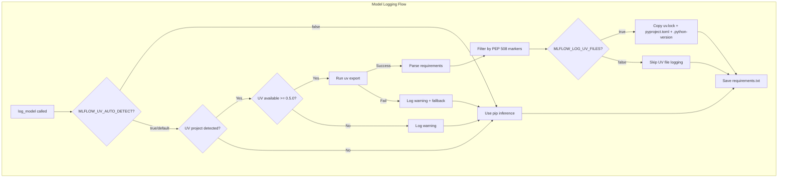
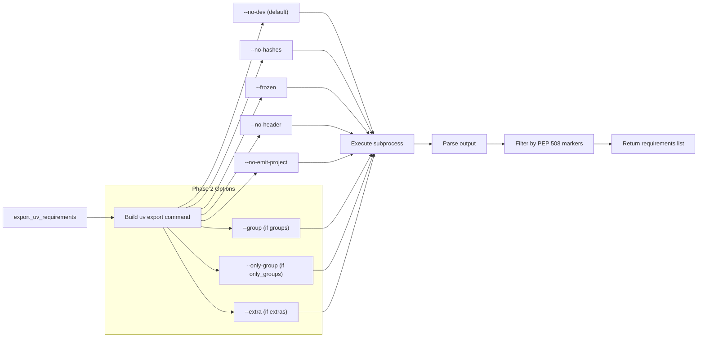
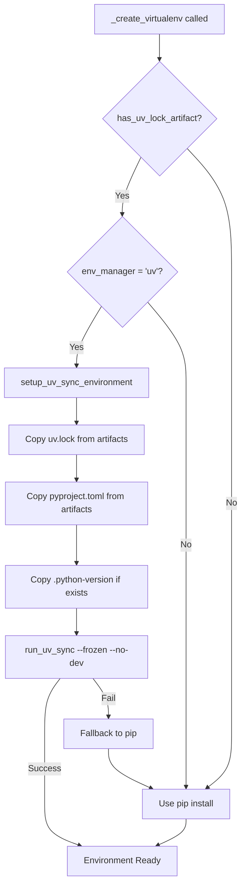

# MLflow UV Package Manager Support

| | |
|----------------------|--------------------------------------------------|
| **Author(s)** | Debu Sinha ([@debu-sinha](https://github.com/debu-sinha)) |
| **Organization** | MLflow Community |
| **Status** | IMPLEMENTED |
| **GitHub Issue** | [#12478](https://github.com/mlflow/mlflow/issues/12478) |
| **Pull Request** | [#20344](https://github.com/mlflow/mlflow/pull/20344) |

**Change Log:**
- 2025-12-05: Initial design version
- 2025-01-26: Updated to reflect actual Phase 1 + Phase 2 implementation
- 2025-01-30: Renamed `uv_lock` parameter to `uv_project_path`; Added `MLFLOW_UV_AUTO_DETECT` env var; Added `_create_virtualenv` integration details

---

## Executive Summary

This document describes the implementation of native UV package manager support in MLflow for automatic dependency inference during model logging. The implementation includes both Phase 1 (MVP) and Phase 2 features.

**What's Implemented:**
- Automatic UV project detection (`uv.lock` + `pyproject.toml`)
- Dependency export via `uv export`
- UV artifacts logging (`uv.lock`, `pyproject.toml`, `.python-version`)
- Explicit `uv_project_path` parameter for monorepo support
- Dependency groups support (`groups`, `only_groups`, `extras`)
- Environment variable configuration
- UV-based environment restoration functions (integrated into `_create_virtualenv`)
- Private index URL extraction utility

---

# Part I: Design Overview

## Motivation

**The Problem (from GitHub Issue #12478):**

> "When using the uv package manager to create virtual environments and install packages, MLflow is unable to infer requirements.txt when auto-logging a model."

Users managing Python environments with UV must manually specify dependencies when logging models - defeating the purpose of MLflow's automatic dependency inference.

**Why UV matters:**
- 8-10x faster than pip (cold cache), 80-115x faster (warm cache)
- Growing adoption in ML community (25+ upvotes, 22+ comments on issue)
- Combines pip, virtualenv, and pyenv functionality
- Better reproducibility via lock files

**Current workaround (painful):**
```python
# Users must manually export and specify dependencies
import subprocess
result = subprocess.run(
    ["uv", "export", "--no-dev", "--no-hashes", "--frozen"],
    capture_output=True, text=True
)
requirements = result.stdout.strip().split("\n")
mlflow.sklearn.log_model(model, "model", pip_requirements=requirements)
```

**Goal:** Make UV projects "just work" with MLflow's existing dependency inference.

---

## Architecture Overview



---

## Phase Implementation Summary

### Phase 1 (MVP) - IMPLEMENTED

| Feature | Status | Description |
|---------|--------|-------------|
| UV Project Detection | Done | Check for `uv.lock` + `pyproject.toml` in CWD |
| Dependency Export | Done | `uv export --no-dev --no-hashes --frozen --no-header --no-emit-project` |
| PEP 508 Marker Filtering | Done | Filter requirements by Python version/platform |
| UV Artifact Logging | Done | Log `uv.lock`, `pyproject.toml`, `.python-version` |
| Monorepo Support | Done | `uv_project_path` parameter for explicit project directory path |
| Disable via Env Var | Done | `MLFLOW_LOG_UV_FILES=false` to skip file logging |
| Disable Auto-Detect | Done | `MLFLOW_UV_AUTO_DETECT=false` to skip UV detection entirely |
| Graceful Fallback | Done | Falls back to pip inference on any UV failure |

### Phase 2 - IMPLEMENTED

| Feature | Status | Description |
|---------|--------|-------------|
| Dependency Groups | Done | `groups`, `only_groups`, `extras` parameters |
| Env Var Configuration | Done | `MLFLOW_UV_GROUPS`, `MLFLOW_UV_ONLY_GROUPS`, `MLFLOW_UV_EXTRAS` |
| UV Sync Functions | Done | `setup_uv_sync_environment()`, `run_uv_sync()` |
| `_create_virtualenv` Integration | Done | UV sync integrated into virtualenv creation |
| Private Index Extraction | Done | Utility function (not auto-integrated) |

### NOT Implemented (Design Decisions)

| Feature | Reason |
|---------|--------|
| `log_uv_files` API parameter | Environment variable approach is less error-prone |
| Auto-prepend index URLs | Error-prone, may inject wrong/stale URLs |
| Parent directory search | CWD-only detection is deterministic and predictable |

---

# Part II: Detailed Implementation

## Core Module: `mlflow/utils/uv_utils.py`

### UV Detection & Version Check

```python
_MIN_UV_VERSION = Version("0.5.0")

def is_uv_available() -> bool:
    """Check if UV is installed and >= 0.5.0."""
    version = get_uv_version()
    return version is not None and version >= _MIN_UV_VERSION

def detect_uv_project(directory: str | Path | None = None) -> dict[str, Path] | None:
    """
    Detect UV project by checking for BOTH uv.lock and pyproject.toml.

    Returns {"uv_lock": Path, "pyproject": Path} or None.
    Note: CWD-only detection (no parent directory search).
    """

def _is_uv_auto_detect_enabled() -> bool:
    """
    Check if UV auto-detection is enabled.

    When disabled via MLFLOW_UV_AUTO_DETECT=false, MLflow skips UV project
    detection entirely and uses standard pip-based dependency inference.
    """
```

### Dependency Export



```python
def export_uv_requirements(
    directory: str | Path | None = None,
    no_dev: bool = True,
    no_hashes: bool = True,
    frozen: bool = True,
    uv_project_path: str | Path | None = None,
    groups: list[str] | None = None,        # Phase 2
    only_groups: list[str] | None = None,   # Phase 2
    extras: list[str] | None = None,        # Phase 2
) -> list[str] | None:
    """
    Export dependencies from UV project to pip-compatible requirements.

    Precedence: only_groups > groups (mutually exclusive)
    extras is additive and can combine with either.
    """
```

### UV Artifact Logging

```python
_MLFLOW_LOG_UV_FILES_ENV = "MLFLOW_LOG_UV_FILES"

def copy_uv_project_files(
    dest_dir: str | Path,
    source_dir: str | Path | None = None,
    uv_project_path: str | Path | None = None,
) -> bool:
    """
    Copy UV project files to model artifact directory.

    Files copied:
    - uv.lock
    - pyproject.toml
    - .python-version (if exists)

    Can be disabled via MLFLOW_LOG_UV_FILES=false
    """
```

---

## Environment Variables

| Variable | Default | Phase | Description |
|----------|---------|-------|-------------|
| `MLFLOW_UV_AUTO_DETECT` | `true` | 1 | Set to `false`/`0`/`no` to disable UV detection entirely |
| `MLFLOW_LOG_UV_FILES` | `true` | 1 | Set to `false`/`0`/`no` to disable UV file logging |
| `MLFLOW_UV_GROUPS` | (none) | 2 | Comma-separated dependency groups to include |
| `MLFLOW_UV_ONLY_GROUPS` | (none) | 2 | Comma-separated groups (exclusive mode, takes precedence) |
| `MLFLOW_UV_EXTRAS` | (none) | 2 | Comma-separated optional extras to include |

**Difference between `MLFLOW_UV_AUTO_DETECT` and `MLFLOW_LOG_UV_FILES`:**

| Variable | UV Detection | UV Export | UV Artifacts |
|----------|--------------|-----------|--------------|
| `MLFLOW_UV_AUTO_DETECT=false` | Skipped | Skipped | Not logged |
| `MLFLOW_LOG_UV_FILES=false` | Performed | Performed | Not logged |

**Usage Examples:**
```bash
# Disable UV detection entirely (use pip inference)
MLFLOW_UV_AUTO_DETECT=false python train.py

# Disable UV file logging (but still use UV export for requirements)
MLFLOW_LOG_UV_FILES=false python train.py

# Include serving group dependencies
MLFLOW_UV_GROUPS="serving" python train.py

# Export ONLY serving group (minimal)
MLFLOW_UV_ONLY_GROUPS="serving" python train.py

# Combine groups and extras
MLFLOW_UV_GROUPS="serving" MLFLOW_UV_EXTRAS="gpu" python train.py
```

---

## Public API Changes

### New Parameter in `log_model()` / `save_model()`

```python
mlflow.pyfunc.log_model(
    python_model=model,
    name="model",
    uv_project_path="/path/to/monorepo/subproject",  # Optional: explicit path for non-CWD projects
)
```

**Note:** The parameter expects a path to the UV project directory (containing `uv.lock`, `pyproject.toml`, and optionally `.python-version`).

**Note:** `log_uv_files` parameter was NOT implemented. Use `MLFLOW_LOG_UV_FILES=false` environment variable instead.

---

## UV-Based Environment Restoration (Phase 2)

The UV sync functionality is integrated into `mlflow/utils/virtualenv.py::_create_virtualenv()`.



### Integration in `_create_virtualenv`

```python
# From mlflow/utils/virtualenv.py
from mlflow.utils.uv_utils import has_uv_lock_artifact, run_uv_sync, setup_uv_sync_environment

def _create_virtualenv(...):
    # Try UV sync if model has uv.lock artifact and using UV env manager
    uv_sync_succeeded = False
    if env_manager == em.UV and has_uv_lock_artifact(local_model_path):
        _logger.info("Found uv.lock artifact, attempting UV sync for environment restoration")
        if setup_uv_sync_environment(env_dir, local_model_path, python_env.python):
            uv_sync_succeeded = run_uv_sync(env_dir, capture_output=capture_output)

    # Fall back to pip-based installation if UV sync was not used or failed
    if not uv_sync_succeeded:
        # ... existing pip install logic
```

### Restoration Functions

```python
def setup_uv_sync_environment(
    env_dir: str | Path,
    model_path: str | Path,
    python_version: str,
) -> bool:
    """Prepare UV project structure for uv sync --frozen."""

def run_uv_sync(
    project_dir: str | Path,
    frozen: bool = True,
    no_dev: bool = True,
) -> bool:
    """Execute uv sync for environment restoration."""

def has_uv_lock_artifact(model_path: str | Path) -> bool:
    """Check if model has uv.lock artifact."""
```

---

## Private Index Handling

**Problem:** `uv export` does not emit `--index-url` / `--extra-index-url`, which can cause pip-based restores to fail for private packages.

**Approach (implemented):**
- Do NOT auto-inject index URLs into requirements.txt (error-prone)
- Provide utility function to extract URLs for manual use/debugging
- Log WARNING when private indexes detected
- Recommend `env_manager="uv"` for private index scenarios

```python
def extract_index_urls_from_uv_lock(uv_lock_path: str | Path) -> list[str]:
    """
    Extract private registry URLs from uv.lock (utility function).

    Uses regex-based extraction (no TOML library dependency).
    Filters out PyPI URLs, returns sorted list of private indexes.
    Logs warning about credential configuration.
    """
```

**Why we don't auto-inject:**
- Index URLs may be environment-specific (dev vs prod)
- Credentials still required - auto-injection gives false sense of security
- Per-package index pinning (`[tool.uv.sources]`) not representable in requirements.txt

**User guidance:**

| Restore Method | Configuration Required |
|----------------|----------------------|
| `env_manager="uv"` (recommended) | Credentials via `UV_INDEX_*` env vars or `.netrc` |
| pip-based restore | Manual config via `pip.conf`, env vars, or `.netrc` |

---

## Graceful Degradation

| Scenario | Behavior |
|----------|----------|
| `MLFLOW_UV_AUTO_DETECT=false` | Skips UV detection entirely, uses pip inference |
| UV not installed | Falls back to pip inference, logs warning |
| UV version < 0.5.0 | Falls back to pip inference, logs warning |
| `uv export` fails | Falls back to pip inference, logs warning |
| No UV project detected | Uses standard pip inference (no warning) |
| `MLFLOW_LOG_UV_FILES=false` | Skips UV file logging, logs info |

---

## Test Coverage

**Total: 122 tests**

### Unit Tests (`tests/utils/test_uv_utils.py`) - 93 tests

- UV version detection and availability
- Project detection (CWD-only)
- Dependency export with various flags
- PEP 508 marker evaluation
- UV file copying
- Environment variable parsing (`MLFLOW_UV_AUTO_DETECT`, `MLFLOW_LOG_UV_FILES`, etc.)
- Private index extraction
- UV sync setup functions

### Integration Tests (`tests/pyfunc/test_uv_model_logging.py`) - 29 tests

- Real UV project creation and locking
- Real `uv export` with dependency groups
- Real `uv sync` environment setup
- End-to-end model logging with UV
- Environment variable behavior

```bash
# Run all UV tests
uv run pytest tests/utils/test_uv_utils.py tests/pyfunc/test_uv_model_logging.py -v
```

---

## Example Usage

### Basic Usage (Just Works)

```python
# User has UV project with uv.lock + pyproject.toml
# No code changes needed!

import mlflow
from sklearn.ensemble import RandomForestClassifier

model = RandomForestClassifier()
model.fit(X_train, y_train)

with mlflow.start_run():
    # UV detected automatically, dependencies exported via uv export
    mlflow.sklearn.log_model(model, "model")
```

### Monorepo Support

```python
mlflow.sklearn.log_model(
    model, "model",
    uv_project_path="/path/to/monorepo/subproject"
)
```

### Disable UV Detection

```bash
# Disable UV auto-detection entirely
MLFLOW_UV_AUTO_DETECT=false python train.py
```

### Disable UV File Logging

```bash
# Via environment variable (recommended)
MLFLOW_LOG_UV_FILES=false python train.py
```

### Selective Dependency Groups

```bash
# Include only serving dependencies
MLFLOW_UV_ONLY_GROUPS="serving" python train.py

# Include serving group + gpu extras
MLFLOW_UV_GROUPS="serving" MLFLOW_UV_EXTRAS="gpu" python train.py
```

---

## Model Artifacts Structure

When a UV project is detected and logged:

```
model/
├── MLmodel
├── model.pkl
├── requirements.txt    # Generated via uv export
├── uv.lock             # Original lock file (for uv sync restore)
├── pyproject.toml      # Project definition
├── .python-version     # Python version (if exists)
└── conda.yaml
```

---

## Design Decisions

### Decision 1: CWD-only vs parent directory search

| Option | Chosen | Rationale |
|--------|--------|-----------|
| CWD-only detection | Yes | Deterministic, predictable, no surprises |
| Parent directory search | No | May find wrong uv.lock in monorepos |

### Decision 2: Environment variable vs API parameter for disabling

| Option | Chosen | Rationale |
|--------|--------|-----------|
| `MLFLOW_LOG_UV_FILES` env var | Yes | No code changes needed, CI/CD friendly |
| `log_uv_files=False` parameter | No | Requires API changes across all flavors |

### Decision 3: Auto-inject private index URLs

| Option | Chosen | Rationale |
|--------|--------|-----------|
| Extract as utility only | Yes | Safe, no risk of wrong URLs |
| Auto-prepend to requirements.txt | No | Error-prone, env-specific URLs |

### Decision 4: TOML parsing for uv.lock

| Option | Chosen | Rationale |
|--------|--------|-----------|
| Regex-based extraction | Yes | No additional dependency |
| tomllib/tomli | No | Adds dependency, overkill for simple extraction |

### Decision 5: Parameter naming for monorepo support

| Option | Chosen | Rationale |
|--------|--------|-----------|
| `uv_project_path` | Yes | Clearer - expects directory containing all UV files |
| `uv_lock` | No | Ambiguous - could imply just the lock file path |

---

## References

1. **GitHub Issue:** [#12478 - Support `uv` Package Installer](https://github.com/mlflow/mlflow/issues/12478)
2. **Pull Request:** [#20344 - Add UV package manager support](https://github.com/mlflow/mlflow/pull/20344)
3. **UV Documentation:** [https://docs.astral.sh/uv/](https://docs.astral.sh/uv/)
4. **UV Benchmarks:** [https://github.com/astral-sh/uv#benchmarks](https://github.com/astral-sh/uv#benchmarks)
