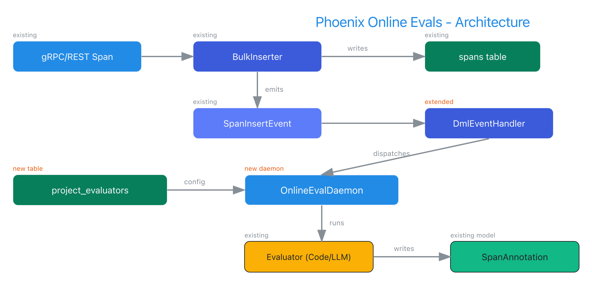
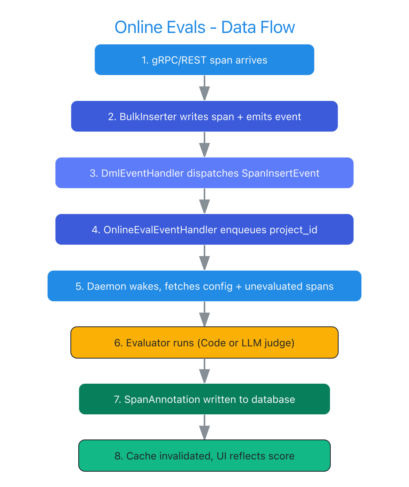

# Phoenix Online Evals - Design Document

|                    |                                                                 |
| ------------------ | --------------------------------------------------------------- |
| **Author(s)**      | Debu Sinha ([@debu-sinha](https://github.com/debu-sinha))       |
| **Organization**   | Phoenix / Arize AI Community                                    |
| **Status**         | DRAFT                                                           |
| **GitHub Issue**   | [#11642](https://github.com/Arize-ai/phoenix/issues/11642)     |
| **Reviewers**      | [@mikeldking](https://github.com/mikeldking) (Mike King, Phoenix Lead Maintainer / Arize AI Co-founder) |

**Change Log:**

- 2026-02-24: Initial design document

---

## Executive Summary

This document proposes an architecture for **Online Evals** in Phoenix: automatic evaluation of spans as they are ingested in real time. Today, Phoenix evaluates spans only in batch mode via the experiments API. Online Evals close this gap by running configured evaluators (LLM or code-based) against incoming spans as they arrive, writing results as `SpanAnnotation` records. This enables continuous quality monitoring without manual experiment runs.

The design extends Phoenix's existing daemon and event infrastructure. A new `OnlineEvalDaemon` subscribes to `SpanInsertEvent` via the `DmlEventHandler`, fetches per-project evaluator configurations, runs evaluators against unevaluated spans, and writes annotations through the existing `POST /evaluations` path. Rate limiting reuses the existing `TokenBucket` class.

**Key design decisions:**

- Follows the `SpanCostCalculator` daemon pattern (deque queue, batched processing, configurable sleep interval)
- Reuses the existing `Evaluator` hierarchy (`CodeEvaluator` / `LLMEvaluator`) and `SpanAnnotation` model
- New `project_evaluators` table for per-project evaluator configuration with sampling rate
- REST API endpoints for CRUD operations on evaluator configs
- Graceful degradation: evaluator failures produce error annotations rather than blocking ingestion

---

# Part I: Design Overview

## Motivation

Phoenix users currently evaluate spans through the experiments API, which requires:

1. Manually creating an experiment
2. Running evaluators against a fixed dataset
3. Reviewing results in the experiments UI

This batch workflow is valuable for systematic evaluation but misses a critical use case: **continuous quality monitoring of production traffic**. Users want to:

- Automatically check every (or a sample of) incoming span for hallucination, toxicity, or relevance
- See evaluation scores on the span detail page as soon as a span is ingested
- Set up evaluators once per project and have them run without manual intervention
- Get alerts when evaluation scores degrade

Online Evals addresses all of these by attaching evaluators to projects that run automatically on span ingestion.

## Current State: What Exists in Phoenix

Phoenix already has the building blocks for Online Evals:

**Daemon infrastructure** (`src/phoenix/server/types.py:76-123`):
- `DaemonTask` abstract base class with async lifecycle management (`start()`, `stop()`, context manager protocol)
- `BatchedCaller` extension for sleep-check-execute patterns
- Real implementations: `SpanCostCalculator` (cost calculation daemon) and `DbDiskUsageMonitor`

**Event system** (`src/phoenix/server/dml_event.py`, `dml_event_handler.py:221-262`):
- `DmlEvent` frozen dataclass hierarchy with MRO-based dispatch in `DmlEventHandler`
- `SpanInsertEvent` already emitted by `BulkInserter` on every span ingestion
- Handler registration pattern: map event types to handler instances

**Evaluator hierarchy** (`src/phoenix/experiments/evaluators/base.py:24-158`):
- `Evaluator` abstract base with `evaluate()` and `async_evaluate()` methods
- `CodeEvaluator` (deterministic, `AnnotatorKind.CODE`) and `LLMEvaluator` (non-deterministic, `AnnotatorKind.LLM`)
- `EvaluationResult` dataclass (`experiments/types.py:223-249`): `score`, `label`, `explanation`, `metadata`

**Annotation storage** (`src/phoenix/db/models.py:937-967`):
- `SpanAnnotation` model with `name`, `label`, `score`, `explanation`, `metadata`, `annotator_kind`, `source`, `identifier`
- `AnnotationConfig` and `ProjectAnnotationConfig` for per-project annotation configuration

**Rate limiting** (`src/phoenix/server/rate_limiters.py:18-56`):
- `TokenBucket` with configurable `per_second_request_rate` and `enforcement_window_seconds`

**REST API** (`src/phoenix/server/api/routers/v1/`):
- `POST /evaluations` endpoint for writing evaluation results as annotations
- Existing router patterns for CRUD operations

## Architecture Overview



The system connects existing components through a new daemon and event handler:

1. **Span Ingestion Path** (existing): gRPC/REST span data arrives, `BulkInserter` writes to the `spans` table, and emits a `SpanInsertEvent`.

2. **Event Dispatch** (extended): `DmlEventHandler` routes the `SpanInsertEvent` to a new `_OnlineEvalEventHandler`, which extracts the `project_id` and enqueues it in the daemon.

3. **Evaluation Loop** (new): `OnlineEvalDaemon` wakes on a configurable interval, drains queued project IDs, fetches evaluator configs (cached), queries unevaluated spans, runs evaluators, and writes `SpanAnnotation` records.

4. **Result Storage** (existing): Annotations stored via the same path as `POST /evaluations`, with cache invalidation for the annotation summary dataloaders.

## Proposed Design Overview

The following table summarizes what each phase delivers.

| Phase | Scope | Key deliverables |
|-------|-------|-----------------|
| Phase 1 (MVP) | Core daemon + config API | `project_evaluators` table, `OnlineEvalDaemon`, event handler, REST CRUD, sampling support |
| Phase 2 (Enhanced) | Observability + reliability | Prometheus metrics, dead letter queue for failed evals, health check endpoint, admin dashboard |
| Phase 3 (Advanced) | Scaling + UX | Per-evaluator rate limiting, priority queues, UI for config management, webhook notifications |

This design document covers **Phase 1** in detail. Phases 2 and 3 are outlined for roadmap context.

---

# Part II: Detailed Implementation

## 1. Database Model: `project_evaluators` Table

A new table stores per-project evaluator configurations. Each row binds an evaluator to a project.

```python
class ProjectEvaluator(Base):
    __tablename__ = "project_evaluators"

    id: Mapped[int] = mapped_column(primary_key=True)
    project_id: Mapped[int] = mapped_column(
        ForeignKey("projects.id", ondelete="CASCADE"),
        index=True,
    )
    name: Mapped[str] = mapped_column(String)
    evaluator_config: Mapped[dict[str, Any]] = mapped_column(JSON)
    enabled: Mapped[bool] = mapped_column(Boolean, default=True)
    sampling_rate: Mapped[float] = mapped_column(
        Float, default=1.0  # 1.0 = evaluate all spans
    )
    created_at: Mapped[datetime] = mapped_column(
        DateTime, server_default=func.now()
    )
    updated_at: Mapped[datetime] = mapped_column(
        DateTime, server_default=func.now(), onupdate=func.now()
    )

    __table_args__ = (
        UniqueConstraint("project_id", "name"),
    )

    project: Mapped["Project"] = relationship("Project", back_populates="evaluators")
```

**Design decisions:**

- `evaluator_config` stores a JSON blob describing the evaluator (type, model, template, parameters). This avoids a rigid schema that would need migration for every evaluator type.
- `sampling_rate` (0.0 to 1.0) controls what fraction of spans get evaluated. Default 1.0 evaluates every span.
- `UniqueConstraint` on `(project_id, name)` prevents duplicate evaluator names per project.
- Cascade delete: when a project is deleted, its evaluator configs are removed.
- Follows the same pattern as `ProjectAnnotationConfig` at `models.py:1939-1948`.

**Alembic migration:**

```python
def upgrade():
    op.create_table(
        "project_evaluators",
        sa.Column("id", sa.Integer(), primary_key=True),
        sa.Column("project_id", sa.Integer(), sa.ForeignKey("projects.id", ondelete="CASCADE")),
        sa.Column("name", sa.String(), nullable=False),
        sa.Column("evaluator_config", sa.JSON(), nullable=False),
        sa.Column("enabled", sa.Boolean(), default=True),
        sa.Column("sampling_rate", sa.Float(), default=1.0),
        sa.Column("created_at", sa.DateTime(), server_default=sa.func.now()),
        sa.Column("updated_at", sa.DateTime(), server_default=sa.func.now()),
    )
    op.create_unique_constraint(
        "uq_project_evaluators_project_name",
        "project_evaluators",
        ["project_id", "name"],
    )
    op.create_index("ix_project_evaluators_project_id", "project_evaluators", ["project_id"])
```

## 2. OnlineEvalDaemon

The core daemon follows the `SpanCostCalculator` pattern: a deque-based queue, configurable sleep interval, and batched processing.

**New file: `src/phoenix/server/daemons/online_eval_daemon.py`**

```python
import asyncio
import random
from collections import deque
from dataclasses import dataclass

from phoenix.db import DbSessionFactory
from phoenix.server.types import DaemonTask

_SLEEP_INTERVAL = 5  # seconds between evaluation cycles
_MAX_SPANS_PER_BATCH = 100  # max spans to evaluate per cycle per project
_MAX_CONCURRENT_EVALS = 10  # max concurrent evaluator invocations


@dataclass(frozen=True)
class _OnlineEvalQueueItem:
    project_id: int


class OnlineEvalDaemon(DaemonTask):
    def __init__(
        self,
        *,
        db: DbSessionFactory,
        sleep_seconds: float = _SLEEP_INTERVAL,
        max_concurrent: int = _MAX_CONCURRENT_EVALS,
        **kwargs: Any,
    ) -> None:
        super().__init__(**kwargs)
        self._db = db
        self._sleep_seconds = sleep_seconds
        self._queue: deque[_OnlineEvalQueueItem] = deque()
        self._semaphore = asyncio.Semaphore(max_concurrent)
        self._config_cache: dict[int, list[ProjectEvaluator]] = {}
        self._config_cache_ttl: float = 30.0  # seconds

    def enqueue_project(self, project_id: int) -> None:
        self._queue.append(_OnlineEvalQueueItem(project_id=project_id))

    async def _run(self) -> None:
        while self._running:
            await asyncio.sleep(self._sleep_seconds)
            if not self._queue:
                continue

            # Drain queue, deduplicate project IDs
            project_ids: set[int] = set()
            while self._queue:
                item = self._queue.popleft()
                project_ids.add(item.project_id)

            # Process each project
            tasks = [
                self._evaluate_project(pid)
                for pid in project_ids
            ]
            await asyncio.gather(*tasks, return_exceptions=True)

    async def _evaluate_project(self, project_id: int) -> None:
        configs = await self._get_evaluator_configs(project_id)
        if not configs:
            return

        unevaluated = await self._fetch_unevaluated_spans(
            project_id, configs
        )
        if not unevaluated:
            return

        for span in unevaluated:
            for config in configs:
                if not config.enabled:
                    continue
                # Apply sampling
                if config.sampling_rate < 1.0:
                    if random.random() > config.sampling_rate:
                        continue

                async with self._semaphore:
                    await self._run_evaluator(span, config)

    async def _get_evaluator_configs(
        self, project_id: int
    ) -> list[ProjectEvaluator]:
        # Check cache (TTL-based)
        # On miss: query project_evaluators table
        # Return enabled configs
        ...

    async def _fetch_unevaluated_spans(
        self, project_id: int, configs: list[ProjectEvaluator]
    ) -> list[Span]:
        # Query spans that don't have annotations matching
        # the evaluator names in configs.
        # Use LEFT JOIN + IS NULL pattern for efficiency.
        # Limit to _MAX_SPANS_PER_BATCH.
        ...

    async def _run_evaluator(
        self, span: Span, config: ProjectEvaluator
    ) -> None:
        # 1. Instantiate evaluator from config.evaluator_config
        # 2. Call evaluator.async_evaluate() with span data
        # 3. Write SpanAnnotation via _insert_annotation()
        # 4. On error: write error annotation (not raise)
        ...

    async def _insert_annotation(
        self, span_rowid: int, config: ProjectEvaluator, result: EvaluationResult
    ) -> None:
        # Insert SpanAnnotation record
        # Invalidate annotation summary cache
        ...
```

**Key design points:**

- **Queue deduplication**: Multiple `SpanInsertEvent`s for the same project collapse into a single evaluation pass. This prevents redundant work during high-throughput ingestion.
- **Semaphore-based concurrency**: Limits concurrent evaluator invocations to `_MAX_CONCURRENT_EVALS` (default 10). Critical for LLM evaluators that make external API calls.
- **Config caching**: Evaluator configs are cached per project with a 30-second TTL. Avoids hitting the database on every evaluation cycle.
- **Sampling**: Each evaluator config has a `sampling_rate`. At rate 0.5, roughly half of incoming spans are evaluated.
- **Error isolation**: Failed evaluations produce error annotations rather than blocking other evaluations or crashing the daemon.

## 3. Event Integration

The daemon subscribes to span ingestion events through a new handler registered in `DmlEventHandler`.

**Modified file: `src/phoenix/server/dml_event_handler.py`**

```python
class _OnlineEvalEventHandler(_DmlEventHandler[SpanInsertEvent]):
    def __init__(self, daemon: OnlineEvalDaemon, db: DbSessionFactory) -> None:
        self._daemon = daemon
        self._db = db

    async def _handle_events(self, events: Iterable[SpanInsertEvent]) -> None:
        # Extract project_ids from the inserted span rowids
        span_rowids = set()
        for event in events:
            span_rowids.update(event.ids)

        if not span_rowids:
            return

        # Query project_ids for these spans
        async with self._db() as session:
            stmt = (
                select(models.Span.project_id)
                .where(models.Span.id.in_(span_rowids))
                .distinct()
            )
            result = await session.execute(stmt)
            project_ids = result.scalars().all()

        for pid in project_ids:
            self._daemon.enqueue_project(pid)
```

**Registration in `DmlEventHandler.__init__`:**

```python
# Existing handlers
self._handlers = {
    DmlEvent: [_GenericDmlEventHandler(...)],
    SpanDmlEvent: [_SpanDmlEventHandler(...)],
    SpanDeleteEvent: [_SpanDeleteEventHandler(...)],
    # ... existing handlers ...
}

# New: Online Eval handler
if online_eval_daemon is not None:
    self._handlers.setdefault(SpanInsertEvent, []).append(
        _OnlineEvalEventHandler(online_eval_daemon, db)
    )
```

The MRO-based dispatch in `DmlEventHandler.put()` (line 260) already walks the class hierarchy. `SpanInsertEvent` inherits from `SpanDmlEvent` inherits from `DmlEvent`, so both the existing `SpanDmlEvent` handler and the new `SpanInsertEvent` handler fire on span insertion. No changes to the dispatch logic are needed.

## 4. REST API Endpoints

**New router: `src/phoenix/server/api/routers/v1/project_evaluators.py`**

CRUD endpoints for managing evaluator configurations per project.

```
GET    /v1/projects/{project_id}/evaluators          # List evaluator configs
POST   /v1/projects/{project_id}/evaluators          # Create evaluator config
GET    /v1/projects/{project_id}/evaluators/{name}    # Get evaluator config
PATCH  /v1/projects/{project_id}/evaluators/{name}    # Update evaluator config
DELETE /v1/projects/{project_id}/evaluators/{name}    # Delete evaluator config
```

**Request/Response schemas:**

```python
class CreateProjectEvaluatorRequest(BaseModel):
    name: str
    evaluator_config: dict[str, Any]
    enabled: bool = True
    sampling_rate: float = Field(default=1.0, ge=0.0, le=1.0)


class ProjectEvaluatorResponse(BaseModel):
    name: str
    evaluator_config: dict[str, Any]
    enabled: bool
    sampling_rate: float
    created_at: datetime
    updated_at: datetime


class UpdateProjectEvaluatorRequest(BaseModel):
    evaluator_config: dict[str, Any] | None = None
    enabled: bool | None = None
    sampling_rate: float | None = Field(default=None, ge=0.0, le=1.0)
```

**Cache invalidation on config changes:**

When evaluator configs are created, updated, or deleted, the daemon's config cache for that project must be invalidated:

```python
@router.post("/v1/projects/{project_id}/evaluators")
async def create_evaluator(
    project_id: int,
    request: CreateProjectEvaluatorRequest,
    db: DbSessionFactory = Depends(get_db),
    daemon: OnlineEvalDaemon = Depends(get_online_eval_daemon),
):
    async with db() as session:
        evaluator = ProjectEvaluator(
            project_id=project_id,
            name=request.name,
            evaluator_config=request.evaluator_config,
            enabled=request.enabled,
            sampling_rate=request.sampling_rate,
        )
        session.add(evaluator)
        await session.commit()

    # Invalidate config cache so daemon picks up the new evaluator
    daemon.invalidate_config_cache(project_id)

    return ProjectEvaluatorResponse(...)
```

## 5. Data Flow



The complete flow for a single span evaluation:

1. **gRPC/REST span arrives**: Client sends span data via OTLP gRPC or REST API.

2. **BulkInserter writes span**: `BulkInserter` batches and inserts the span into the `spans` table. Emits `SpanInsertEvent(ids=(span_rowid,))`.

3. **DmlEventHandler dispatches**: Routes `SpanInsertEvent` to registered handlers via MRO walk. Both the existing `_SpanDmlEventHandler` (for cache invalidation) and the new `_OnlineEvalEventHandler` fire.

4. **Handler extracts project_id**: Queries the span's `project_id` from the database and calls `daemon.enqueue_project(project_id)`.

5. **Daemon wakes**: After `_SLEEP_INTERVAL` (5s), the daemon drains the queue. Deduplicates project IDs (multiple spans for the same project collapse into one evaluation pass).

6. **Config fetch**: Loads evaluator configs for the project from cache (30s TTL) or database. Filters to enabled configs only.

7. **Unevaluated span query**: For each evaluator, queries spans that lack a `SpanAnnotation` with a matching `name` and `identifier`. Uses `LEFT JOIN ... IS NULL` pattern with `LIMIT _MAX_SPANS_PER_BATCH`.

8. **Evaluator execution**: Instantiates the evaluator from the JSON config. Calls `evaluator.async_evaluate()` with span attributes (output, input, metadata). Bounded by `asyncio.Semaphore(max_concurrent)`.

9. **Annotation write**: Converts `EvaluationResult` to `SpanAnnotation` record. Sets `annotator_kind` based on evaluator type (LLM or CODE), `source = "APP"`, `identifier` to a daemon-specific value for tracking.

10. **Cache invalidation**: Emits `SpanAnnotationInsertEvent` so annotation summary dataloaders refresh. The span detail page reflects the new evaluation immediately.

## 6. Concurrency and Rate Limiting

**Internal concurrency:**

- `asyncio.Semaphore(max_concurrent)` bounds the number of in-flight evaluator calls. Default 10, configurable via constructor.
- Each project's evaluators run sequentially within a batch (to avoid overwhelming a single LLM provider with parallel requests for the same project).
- Different projects can be evaluated in parallel via `asyncio.gather()`.

**External rate limiting:**

For LLM evaluators that call external APIs (OpenAI, Anthropic, etc.), the daemon integrates with Phoenix's existing `TokenBucket` (`rate_limiters.py:18-56`):

```python
# Per-evaluator rate limit (configurable in evaluator_config)
rate_limiter = TokenBucket(
    per_second_request_rate=config.evaluator_config.get("rate_limit", 10),
    enforcement_window_seconds=1.0,
)
```

**Backpressure:**

If the queue grows beyond a configurable threshold (default 10,000 items), the daemon drops the oldest entries and logs a warning. This prevents unbounded memory growth during ingestion spikes.

## 7. Error Handling

| Failure mode | Behavior |
|-------------|----------|
| Evaluator throws exception | Write error annotation with `explanation = str(error)`. Continue to next span. |
| LLM API timeout | Retry once after 5s. On second failure, write error annotation. |
| Config fetch failure | Log warning, skip project for this cycle. Retry next cycle. |
| Database write failure | Log error, skip annotation. Span remains "unevaluated" and will be picked up next cycle. |
| Daemon crash | `DaemonTask` lifecycle handles restart via `_lifespan()` AsyncExitStack. |

Error annotations use a distinct `identifier` prefix (e.g., `online-eval-error`) so they can be filtered in the UI.

## 8. Configuration

**Environment variables:**

| Variable | Default | Description |
|----------|---------|-------------|
| `PHOENIX_ONLINE_EVALS_ENABLED` | `true` | Enable/disable the Online Eval daemon globally |
| `PHOENIX_ONLINE_EVALS_SLEEP_SECONDS` | `5` | Seconds between evaluation cycles |
| `PHOENIX_ONLINE_EVALS_MAX_CONCURRENT` | `10` | Maximum concurrent evaluator invocations |
| `PHOENIX_ONLINE_EVALS_MAX_BATCH_SIZE` | `100` | Maximum spans to evaluate per cycle per project |

**Per-project configuration** is managed through the REST API (`POST /v1/projects/{project_id}/evaluators`). Each evaluator config includes:

```json
{
  "name": "hallucination_check",
  "evaluator_config": {
    "type": "llm",
    "model": "openai/gpt-4o-mini",
    "template": "...",
    "threshold": 0.5
  },
  "enabled": true,
  "sampling_rate": 0.1
}
```

## 9. App Wiring

**Modified file: `src/phoenix/server/app.py`**

```python
# In create_app() (line ~986+)
online_eval_daemon = None
if get_env_online_evals_enabled():
    online_eval_daemon = OnlineEvalDaemon(
        db=db,
        sleep_seconds=get_env_online_evals_sleep_seconds(),
        max_concurrent=get_env_online_evals_max_concurrent(),
    )

# Pass to DmlEventHandler
dml_event_handler = DmlEventHandler(
    db=db,
    # ... existing params ...
    online_eval_daemon=online_eval_daemon,  # new param
)

# In _lifespan() (line ~609+)
async with AsyncExitStack() as stack:
    await stack.enter_async_context(bulk_inserter)
    await stack.enter_async_context(dml_event_handler)
    if online_eval_daemon is not None:
        await stack.enter_async_context(online_eval_daemon)
    # ... rest of lifespan ...
```

## 10. Test Plan

**Unit tests:**

| Test | What it verifies |
|------|-----------------|
| `test_online_eval_daemon_processes_queue` | Daemon drains queue, deduplicates project IDs, calls `_evaluate_project` |
| `test_online_eval_daemon_respects_sampling` | At rate 0.5, roughly half of spans are evaluated (statistical test with tolerance) |
| `test_online_eval_daemon_semaphore_bounds_concurrency` | No more than `max_concurrent` evaluators run simultaneously |
| `test_online_eval_daemon_config_cache_ttl` | Config cache expires after TTL, re-fetches from DB |
| `test_online_eval_daemon_error_isolation` | Failed evaluator writes error annotation, does not block other evaluators |
| `test_event_handler_extracts_project_ids` | `_OnlineEvalEventHandler` correctly maps span rowids to project IDs |
| `test_event_handler_enqueues_projects` | Handler calls `daemon.enqueue_project()` for each distinct project |

**Integration tests:**

| Test | What it verifies |
|------|-----------------|
| `test_span_ingestion_triggers_evaluation` | End-to-end: ingest span, daemon runs evaluator, annotation appears in DB |
| `test_config_crud_invalidates_cache` | Creating/updating/deleting evaluator config invalidates daemon cache |
| `test_disabled_evaluator_skipped` | Evaluator with `enabled=False` is not invoked |
| `test_unevaluated_span_detection` | Only spans without matching annotations are returned by `_fetch_unevaluated_spans` |

**API tests:**

| Test | What it verifies |
|------|-----------------|
| `test_create_evaluator_config` | `POST /v1/projects/{id}/evaluators` creates config and returns 201 |
| `test_duplicate_evaluator_name_rejected` | Creating duplicate (project_id, name) returns 409 |
| `test_update_evaluator_config` | `PATCH` updates specified fields only |
| `test_delete_evaluator_config` | `DELETE` removes config, daemon stops evaluating |
| `test_list_evaluator_configs` | `GET` returns all configs for a project |

---

## Design Decisions

| Decision | Choice | Alternatives considered | Rationale |
|----------|--------|------------------------|-----------|
| Daemon pattern | Extend `DaemonTask` with deque queue | `BatchedCaller`, Celery, separate process | `DaemonTask` matches `SpanCostCalculator` pattern exactly. No external dependencies. In-process for simplicity. |
| Config storage | JSON blob in `evaluator_config` column | Separate tables per evaluator type, TOML file | JSON avoids schema migrations when new evaluator types are added. Flexible for code and LLM evaluators. |
| Evaluator instantiation | From JSON config at evaluation time | Pre-instantiated singletons, factory registry | Runtime instantiation allows config changes to take effect without daemon restart. |
| Unevaluated span detection | `LEFT JOIN span_annotations ... IS NULL` | Separate tracking table, Redis set | SQL join is simple, correct, and uses existing indexes. No new infrastructure needed. |
| Concurrency control | `asyncio.Semaphore` | Thread pool, process pool, external queue | Semaphore is lightweight and sufficient for I/O-bound LLM API calls. No serialization overhead. |
| Event subscription | `SpanInsertEvent` via `DmlEventHandler` | Polling the spans table, database triggers | Event-driven is more efficient than polling. Reuses existing event infrastructure. |
| Annotation identifier | `"online-eval:{evaluator_name}"` | UUID, timestamp-based | Deterministic identifier enables idempotent re-evaluation and easy filtering. |
| Cache invalidation | TTL-based (30s) + explicit invalidation on config change | No cache, LRU, event-driven | TTL provides eventual consistency. Explicit invalidation on CRUD operations provides immediate consistency when users change configs. |

## Files to Create/Modify

**New files:**

| File | Purpose |
|------|---------|
| `src/phoenix/server/daemons/online_eval_daemon.py` | `OnlineEvalDaemon` class |
| `src/phoenix/server/api/routers/v1/project_evaluators.py` | REST API router for evaluator CRUD |
| `src/phoenix/db/migrations/versions/xxxx_add_project_evaluators.py` | Alembic migration |
| `tests/server/daemons/test_online_eval_daemon.py` | Unit tests for daemon |
| `tests/server/api/routers/v1/test_project_evaluators.py` | API tests |
| `tests/integration/test_online_evals_e2e.py` | End-to-end integration tests |

**Modified files:**

| File | Change |
|------|--------|
| `src/phoenix/db/models.py` | Add `ProjectEvaluator` model |
| `src/phoenix/server/dml_event_handler.py` | Add `_OnlineEvalEventHandler`, register for `SpanInsertEvent` |
| `src/phoenix/server/app.py` | Instantiate daemon in `create_app()`, add to `_lifespan()` |
| `src/phoenix/server/api/routers/v1/__init__.py` | Register new router |

## References

- Phoenix Issue [#11642: Online Evals](https://github.com/Arize-ai/phoenix/issues/11642)
- Phoenix Issue [#11650: Project Evaluators](https://github.com/Arize-ai/phoenix/issues/11650) (related)
- `SpanCostCalculator` daemon implementation: `src/phoenix/server/daemons/span_cost_calculator.py`
- `DmlEventHandler` event dispatch: `src/phoenix/server/dml_event_handler.py:221-262`
- `DaemonTask` base class: `src/phoenix/server/types.py:76-101`
- `Evaluator` hierarchy: `src/phoenix/experiments/evaluators/base.py:24-158`
- `SpanAnnotation` model: `src/phoenix/db/models.py:937-967`
- `TokenBucket` rate limiter: `src/phoenix/server/rate_limiters.py:18-56`
